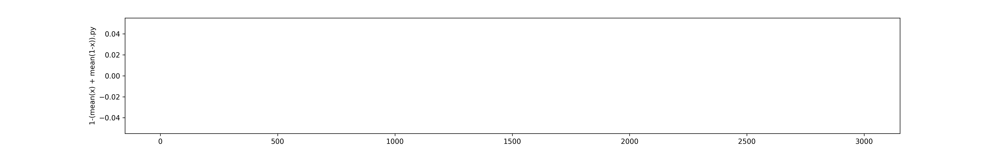
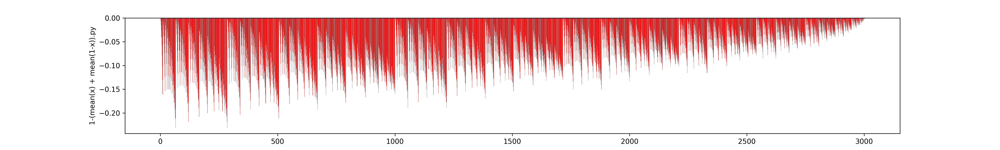
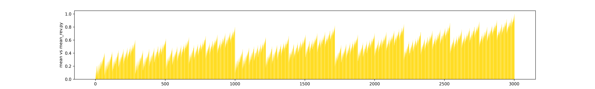
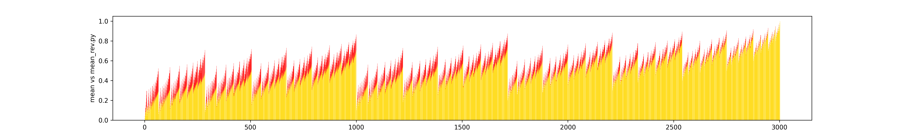

# SelfDuality

## Działanie algorytmu

Zaimplementowany algorytm podejmuje decyzję w oparciu o prawdopodobieństwa zbioru kilku klasyfikatorów.

#### Przykład 1

Mamy 5 drzew decyzyjnych. Każde z drzew zwraca prawdopodobieństwo klasy 0 i 1.

|nr. drzewa| class 0 | class 1
|----------|---------|--------
|1         | 0.1     | 0.9
|2         | 0.1     | 0.9
|3         | 0.08    | 0.92
|4         | 0.5     | 0.5
|5         | 0.2     | 0.8

Suma prawdopodobieństw wynosi 1.

Do obliczenia ostatecznej agregujemy decyzje dla klasy 1:(Pakiet scikit learn do obliczenia auc_score wykorzystuje prawdopodobieństwo klasy 1 https://scikit-learn.org/stable/modules/generated/sklearn.metrics.roc_auc_score.html)
```python
decision = mean([0.9, 0.9, 0.92, 0.5, 0.8])
print(decision)

>>> 0.804
```

## Problem self dualności

Średnia arytmetyczna jest self dualna. Oznacza to że sumując obliczoną średnią dla klasy 0 oraz średnią dla klasy 1 otrzymamy 1.
```python
dec1 = mean([0.9, 0.9, 0.92, 0.5, 0.8])
dec2 = mean([0.1, 0.1, 0.08, 0.5, 0.2])
print(dec1 + dec2)

>>> 1
```

Większość agregacji nie spełnia tego założenia w wyniku czego sumując średnią dla klasy 0 oraz średnią dla klasy 1 nie otrzymamy wartości równej 1.

```python
dec1 = mean([0.9, 0.9, 0.92, 0.5, 0.8])
dec2 = mean([0.1, 0.1, 0.08, 0.5, 0.2])
print(dec1 + dec2)

>>> 0.83 // (Wartość przykładowa)
```

Stanowi to problem przy problemie klasyfikacji. Odwracając Etykiety klas otrzymamy inną skuteczniść AUC.

#### Przykład 2

|nr. drzewa| class 0 | class 1
|----------|---------|--------
|1         | 0.9     | 0.1      
|2         | 0.9     | 0.1      
|3         | 0.92    | 0.08      
|4         | 0.5     | 0.5      
|5         | 0.8     | 0.2      

Obliczajac wynik dla średniej arytmetycznej wynik będzie taki jak oczekujemy:
```python
decision = mean([0.1, 0.1, 0.08, 0.5, 0.2])
print(decision)

>>> 0.196
```
Natomiast obliczając wynik agregacją która nie spełnia warunku selfdualności wynik może być następujący:
```python
decision = mean([0.1, 0.1, 0.08, 0.5, 0.2])
print(decision)

>>> 0.5 // Wartość przykładowa
```

Konsekwencją tego jest różna skuteczność AUC po zamianie etykiet. Ustalając próg t= 0.5 nasz testowany obiekt będzie miał klasę zarówno przed jak i po zamianie etykiet.

## Wizualizacja

Stworzono zbiór 5 elementowych list z kombinacjami wartości [0, 0.1, 0.2, 0.3, 0.4, 0.5, 0.6, 0.7, 0.8, 0.9, 1]
Dla każdej listy obliczono wartość agregacji oraz wartość agregacji dla 1-lista.

Według wzoru 1 - (mean(x) + mean(1-x)) oczekiwana wartość jest równa 1. Dla średniej arytmetycznej założenie jest spełnione:


Natomiast dla średniej wykładniczej A6 z parametrem r=2 suma mean(x) + mean(1-x) wykracza poza 1.


#### Różnica w wartościach
Powyższe wykresy obrazują różnice w wartościach.
- żółty = mean(x)
- czerwony = 1 - mean(1-x)

Średnia Arytmetyczna:

Średnia Wykładniacza A6:


W powyższych przykładach można zauważyć że ustawiając parametr t = 0.5 w niektórych przypadkach otrzymamy różne klasy decyzyjne dla tego samego obiektu testowewgo.
